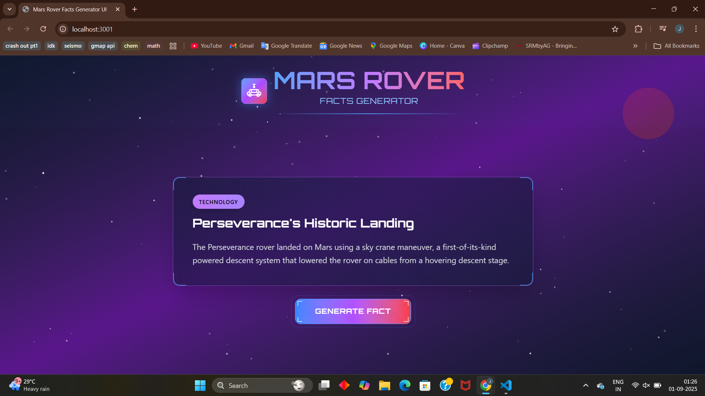
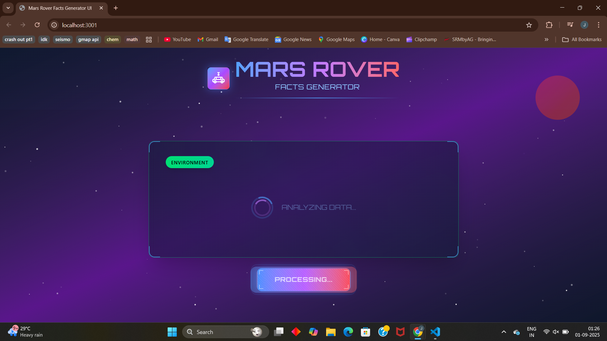

# 🚀 Mars Rover Facts Generator  

A simple and interactive web app that generates random facts about Mars rovers.  
Built with **TypeScript, HTML, and Tailwind CSS** using **Generative AI tools**, this project showcases my ability to craft effective prompts, refine outputs, and transform them into a clean, functional UI.  

---

## ✨ Features  
- Displays random Mars rover facts  
- Responsive and minimal UI with Tailwind CSS  
- Lightweight, fast, and beginner-friendly codebase  

---

## 📸 Screenshots  

### 🏠 Homepage  
  

### 🔄 Analyzing data
  

### 🤖 New Fact (Example 1)  
  

### 🤖 New Fact (Example 2)  
 

---

## 🔧 Tech Stack  
- **TypeScript**  
- **HTML**  
- **Tailwind CSS**  
- **Generative AI assistance** for code & UI scaffolding  

---

## 🚀 Getting Started  
### 1. Clone the repository  
```bash
git clone https://github.com/JaynaShirlie/Mars-Rover-Facts-Generator.git
cd mars-rover-facts-generator

  Run `npm i` to install the dependencies.
  Run `npm run dev` to start the development server.
```

---
**P.S.** Yes, this project was made with Generative AI — but here’s the thing: not everyone can just throw prompts at an AI and magically end up with a functional, visually appealing UI.  
It takes skill to guide the AI, refine its messy outputs, and turn them into something polished — and I did that in *very little time*.  

So, while the code may have started in the AI’s hands, the final product reflects **my ability to prompt, adapt, and design**. That’s the real skill I’m showing here 🚀
